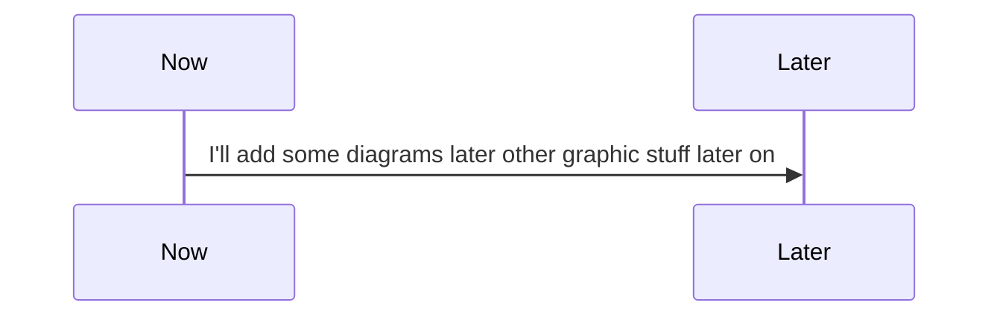

# Lac: A (Ruby) Webscraping Framework!

Lac is a framework used to create and manage projects aimed at scraping data from websites.

## The Goal
The main goal of Lac is to reduce the work required to gather data form the open web. Leading for the design decisions in the future should be:

 1. Enabling users to write and manage scrapers with DRY code
 2. User workflow should resemble well known (web) frameworks (partly inspired on Ruby on Rails)
 3. 

# Getting started
In this part we'll quickly go through the steps to get started using Lac.

## Installation
Lac is a RubyGem. Make sure you have Ruby installed and run:

`$ gem install lac`


## Create project files and folders

When Lac is installed, you can use the command line tool to generate a project.

`$ lac new`

Now you will be able to enter a project name and the 

```
[Success] created directory!    ./[PROJECT_NAME]/
[Success] created directory!    ./[PROJECT_NAME]/config
[Success] created directory!    ./[PROJECT_NAME]/cache
[Success] created directory!    ./[PROJECT_NAME]/models
[Success] created directory!    ./[PROJECT_NAME]/scrapers
[Success] created directory!    ./[PROJECT_NAME]/helpers
[Success] created file!     ./[PROJECT_NAME]/Gemfile
[Success] created file!     ./[PROJECT_NAME]/config/wsfr.rb
```

## Technical stuff




